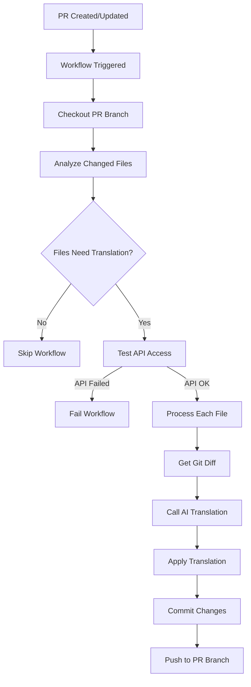

# Translation Sync System - Technical Architecture

## System Overview

The automated translation system consists of three main components working together to synchronize English and Italian documentation in the NethVoice project.

## File Components

### 1. GitHub Workflow (`.github/workflows/sync-translations.yml`)

**Purpose**: Orchestrates the entire translation workflow
**Trigger Conditions**:
- Pull Request created or updated
- Target branch: `main`
- Modified files: `*.md` or `*.mdx` in documentation directories
- Repository: Internal PRs only (not forks)

**Workflow Steps**:
1. **File Analysis**: Identifies changed documentation files
2. **API Testing**: Verifies GitHub Models API access (fail-fast approach)  
3. **Translation Processing**: Calls Python agent for each changed file
4. **Git Operations**: Commits and pushes translations to PR branch

**Key Features**:
- Conditional execution (only runs when translation is needed)
- Fail-fast API testing to prevent partial execution
- Conventional Commits compliance
- Automatic branch management

### 2. Translation Sync Agent (`.github/scripts/translation-agent/translation-sync-agent.py`)

**Purpose**: Core translation logic and file processing
**Main Class**: `DocumentationSyncAgent`

**Key Methods**:
- `get_file_diff()`: Extracts git diff for specific files
- `map_en_to_it_path()` / `map_it_to_en_path()`: Bidirectional path mapping
- `analyze_changes_with_ai()`: AI-powered translation using GitHub Models
- `apply_translation_to_file()`: Applies translations to target files
- `sync_translation()`: Orchestrates the translation process

**Translation Features**:
- Git diff analysis to identify only new/modified content
- Structured AI prompts with formatting rules
- Markdown preservation (links, IDs, code blocks)
- Intelligent title translation with examples
- Technical terminology consistency

**AI Integration**:
- **Model**: `openai/gpt-4o` via GitHub Models API
- **Authentication**: GitHub token with Copilot access
- **Prompt Engineering**: Structured instructions for consistent output
- **Error Handling**: Graceful degradation and retry logic

### 3. API Testing Script (`.github/scripts/translation-agent/test-copilot-access.py`)

**Purpose**: Validates GitHub Models API connectivity before processing
**Function**: Performs a lightweight API test to ensure translation capability

**Test Process**:
- Attempts connection to GitHub Models endpoint
- Validates authentication and model access
- Returns success/failure status for workflow decision
- Prevents unnecessary file processing if API is unavailable

**Integration**: Called by workflow before translation agent execution

## Path Mapping System

**Mapping Logic**:
```
English: docs/tutorial/example.md
Italian: i18n/it/docusaurus-plugin-content-docs/current/tutorial/example.md
```

**Directory Structure**:
```
English Documentation (docs/):
├── tutorial/
├── administrator-manual/
├── user-manual/
└── intro.md

Italian Documentation (i18n/it/docusaurus-plugin-content-docs/current/):
├── tutorial/
├── administrator-manual/
├── user-manual/
└── intro.md
```

## Workflow Execution Flow



## Translation Rules Implementation

### AI Prompt Structure

The agent uses carefully crafted prompts with specific rules:

```python
CRITICAL FORMATTING RULES:
- NEVER include markdown code blocks markers like ```markdown
- Translate section titles when appropriate
- Do NOT translate common technical terms (API, Login, Feedback)
- Update heading IDs to match translated titles
- Preserve all markdown formatting and links
```

### Title Translation Examples
Implemented in the agent's prompt:
- "Test section" → "Sezione di test"
- "Configuration" → "Configurazione"
- "API" → "API" (no translation)
- "Dashboard" → "Dashboard" (no translation)

### Content Preservation
- **Section IDs**: `{#section-id}` maintained exactly
- **Links**: Internal `[text](path.md)` and external links preserved
- **Code blocks**: Syntax and content unchanged
- **Email addresses**: Format preserved `[email](mailto:email)`
- **UI elements**: Bold formatting maintained `**Install**`

## Technical Implementation Details

### Git Operations
- **Diff Analysis**: Uses `git diff origin/main..HEAD` to identify changes
- **File Detection**: Processes `.md` and `.mdx` files only  
- **Branch Management**: Works directly on PR branch
- **Commit Strategy**: Single conventional commit per PR

### AI Integration Specifics
- **Endpoint**: `https://models.github.ai/inference/chat/completions`
- **Model**: `openai/gpt-4o` 
- **Temperature**: 0-0.2 (for consistent translations)
- **Authentication**: GitHub token with Copilot subscription
- **Timeout**: 30 seconds per request

### Error Handling Strategy
1. **API Failures**: Fail-fast with clear error messages
2. **File Not Found**: Skip with warning, continue processing
3. **Translation Errors**: Log error, continue with remaining files
4. **Git Errors**: Stop execution, preserve repository state

## Security and Permissions

### GitHub Actions Permissions
```yaml
permissions:
  contents: write          # For committing translations
  pull-requests: write     # For PR operations  
  actions: read           # For workflow context
```

### API Security
- Uses organization's GitHub Copilot subscription
- No additional secrets required
- All operations within GitHub ecosystem
- Full audit trail in workflow logs

## Performance Considerations

### Optimization Features
- **Conditional Execution**: Only runs when translation needed
- **File-by-File Processing**: Prevents memory issues with large PRs
- **API Fail-Fast**: Avoids processing without translation capability
- **Single Commit**: Reduces git operations

### Resource Usage
- **CPU**: Minimal (mainly I/O operations)
- **Memory**: Low footprint per file
- **API Calls**: One per changed file
- **Execution Time**: ~30 seconds per file

## Monitoring and Debugging

### Workflow Logs Structure
```
🤖 Starting Translation Sync Agent
📝 Processing file: docs/tutorial/example.md
🔄 EN → IT: docs/tutorial/example.md → i18n/it/.../example.md
✅ Translation completed
```

### Debug Information
- Git diff output preview
- Translation content preview  
- File path mappings
- API response status
- Error details with context

## Current System Limitations

1. **Content Handling**:
   - Optimized for new section additions
   - Limited support for complex content modifications
   - No cross-file context awareness

2. **Translation Quality**:
   - Requires human review for accuracy
   - No automatic quality validation
   - Limited terminology management

3. **File Dependencies**:
   - Doesn't handle related images or includes
   - No automatic sidebar updates
   - No validation of internal link consistency

## Future Enhancement Opportunities

1. **Intelligent Modifications**: Better handling of existing content changes
2. **Quality Assurance**: Automated translation quality checks
3. **Context Awareness**: Cross-file translation consistency
4. **Asset Management**: Automatic handling of images and dependencies